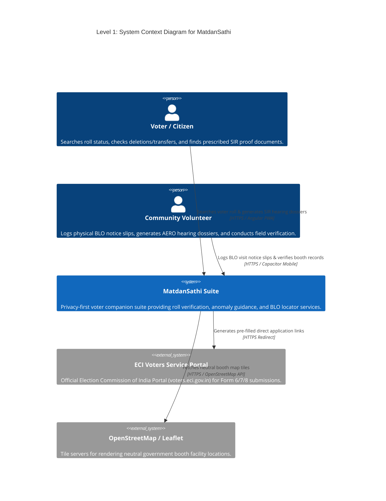
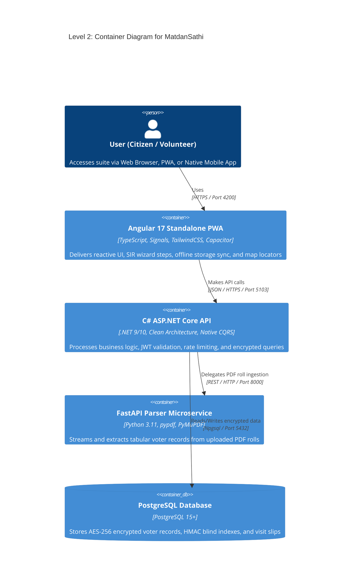
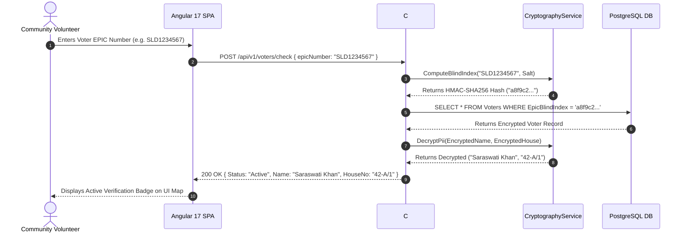
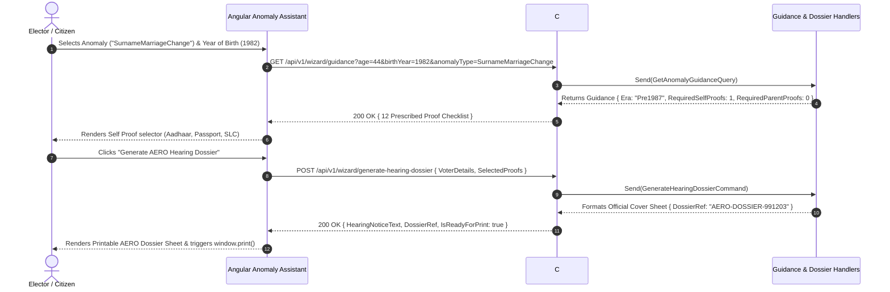

# Architecture Decision Records (ADRs) & System Design for MatdanSathi

## 📌 Index of Architecture Decision Records

| ADR ID | Title | Status | Date |
|---|---|---|---|
| [ADR-001](#adr-001-native-mit-c-mediator-cqrs-pattern) | Native MIT C# Mediator CQRS Pattern over Commercial Dependencies | Accepted | 2026-07-26 |
| [ADR-002](#adr-002-zero-raw-pii-persistence-via-aes-256--hmac-sha256-blind-indexes) | Zero Raw PII Persistence via AES-256 Encryption & Deterministic Blind Indexes | Accepted | 2026-07-26 |
| [ADR-003](#adr-003-decoupled-streaming-python-parser-microservice) | Decoupled Streaming Python Parser Microservice (pypdf / PyMuPDF) | Accepted | 2026-07-26 |
| [ADR-004](#adr-004-angular-17-signals--capacitor-native-hybrid-wrapper) | Angular 17+ Standalone Signals & Capacitor Cross-Platform Architecture | Accepted | 2026-07-26 |

---

### ADR-001: Native MIT C# Mediator CQRS Pattern

*   **Status**: Accepted
*   **Context**: MediatR v13+ moved to a paid dual-license model. To guarantee that MatdanSathi remains 100% open-source, permissive (MIT/Apache 2.0), and cost-free for public civic deployment, all commercial OR dual-licensed packages must be eliminated.
*   **Decision**: Implement a zero-dependency, native C# `IMediator`, `IRequest<TResponse>`, and `IRequestHandler<TRequest, TResponse>` pattern. Handlers are registered via assembly reflection scan (`services.AddScoped(interface, implementation)`) and executed dynamically via `NativeMediator`.
*   **Consequences**: Eliminates legal licensing risks, reduces runtime memory footprint, eliminates external package bloat, and preserves 100% MediatR CQRS decoupling semantics.

---

### ADR-002: Zero Raw PII Persistence via AES-256 & HMAC-SHA256 Blind Indexes

*   **Status**: Accepted
*   **Context**: Storing cleartext voter PII (Names, Phone Numbers, Email, DOB, House Numbers) creates severe data privacy and legal compliance liabilities.
*   **Decision**: 
    1. All sensitive voter PII fields are encrypted at rest using AES-256 field encryption.
    2. For exact-match queries (e.g. checking EPIC or Phone), generate a deterministic `HMAC-SHA256` blind index with a server secret salt.
*   **Consequences**: Databases containing compromised backups reveal zero readable PII. Enables exact-match lookup speed without sacrificing privacy. Partial fuzzy searches are restricted to non-sensitive fields.

---

### ADR-003: Decoupled Streaming Python Parser Microservice

*   **Status**: Accepted
*   **Context**: Parsing 100+ page Indian Electoral Roll PDFs requires heavy text extraction and regex matching that would bloat the main Web API process.
*   **Decision**: Decouple PDF extraction into a dedicated FastAPI Python microservice using stream-based `pypdf` (BSD 3-Clause) and `PyMuPDF` engines.
*   **Consequences**: Prevents memory spikes on the .NET API container. Memory-bounded page-by-page streaming allows handling large PDF rolls under 100MB RAM usage.

---

### ADR-004: Angular 17+ Signals & Capacitor Native Hybrid Wrapper

*   **Status**: Accepted
*   **Context**: Grassroots volunteers require cross-platform availability across Web Browsers, PWAs, Android, and iOS devices with offline local storage sync.
*   **Decision**: Use Angular 17 Standalone Components with Signals for fine-grained reactive state management. Wrap the web build with `@capacitor/core` for native iOS (WKWebView) and Android deployment.
*   **Consequences**: Single TypeScript codebase targets Web, PWA, Android APK, and iOS IPA targets without duplicate code maintenance.

---

## 🏛️ C4 Architecture Model





```mermaid
C4Component
    title Level 3: Component Diagram for Backend C# .NET Core API

    Container(frontend, "Angular 17 PWA", "Frontend Client")
    ContainerDb(database, "PostgreSQL", "Database")

    Container_Boundary(backend_boundary, "Backend C# .NET API Boundary") {
        Component(wizard_ctrl, "WizardController", "ASP.NET Core Controller", "Exposes /api/v1/wizard/ endpoints")
        Component(blo_ctrl, "BloController", "ASP.NET Core Controller", "Exposes /api/v1/blo/ endpoints")
        Component(voters_ctrl, "VotersController", "ASP.NET Core Controller", "Exposes /api/v1/voters/ endpoints")
        
        Component(mediator, "NativeMediator", "Native C# Service", "Zero-dependency MIT mediator routing queries & validating inputs")
        
        Component(guidance_handler, "GetAnomalyGuidanceQueryHandler", "CQRS Handler", "Calculates ECI era cutoff rules (Pre-1987, 1987-2004, Post-2004)")
        Component(dossier_handler, "GenerateHearingDossierCommandHandler", "CQRS Handler", "Formats official AERO hearing cover sheet payloads")
        Component(crypto, "CryptographyService", "Infrastructure Service", "Performs AES-256 encryption & HMAC-SHA256 blind indexing")
        Component(efcore, "ApplicationDbContext", "EF Core Layer", "Executes parameterized SQL queries against PostgreSQL")
    }

    Rel(frontend, wizard_ctrl, "Requests guidance & dossiers", "HTTP POST/GET")
    Rel(frontend, blo_ctrl, "Schedules BLO visit slips", "HTTP POST")
    Rel(frontend, voters_ctrl, "Queries voter check", "HTTP POST")

    Rel(wizard_ctrl, mediator, "Sends GetAnomalyGuidanceQuery", "In-Process Call")
    Rel(blo_ctrl, mediator, "Sends ScheduleBloVisitCommand", "In-Process Call")
    Rel(voters_ctrl, mediator, "Sends CheckVoterRegistrationQuery", "In-Process Call")

    Rel(mediator, guidance_handler, "Dispatches", "In-Process Call")
    Rel(mediator, dossier_handler, "Dispatches", "In-Process Call")

    Rel(guidance_handler, crypto, "Encrypts/Decrypts PII", "In-Process Call")
    Rel(guidance_handler, efcore, "Queries DB", "In-Process Call")
    Rel(efcore, database, "Executes SQL", "Npgsql Connection")
```

---

## 🔄 Sequence Diagrams (Runtime Flows)

### Sequence 1: Deterministic Blind Index Voter Search & Verification



### Sequence 2: SIR Anomaly Guidance & AERO Hearing Dossier Flow


