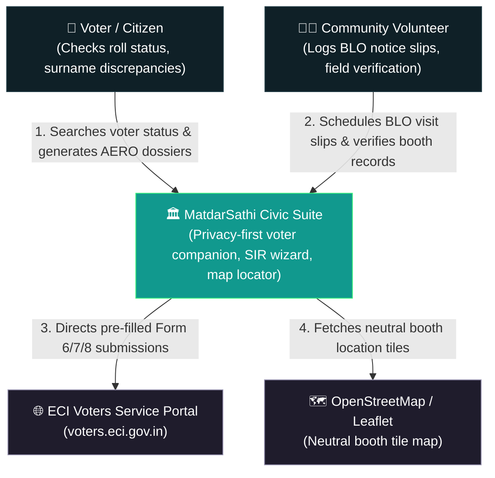
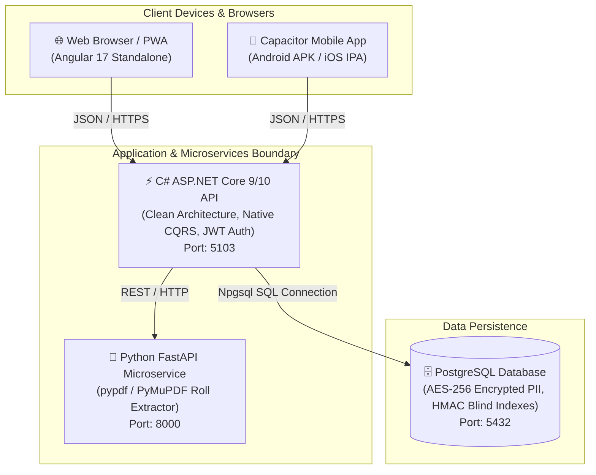
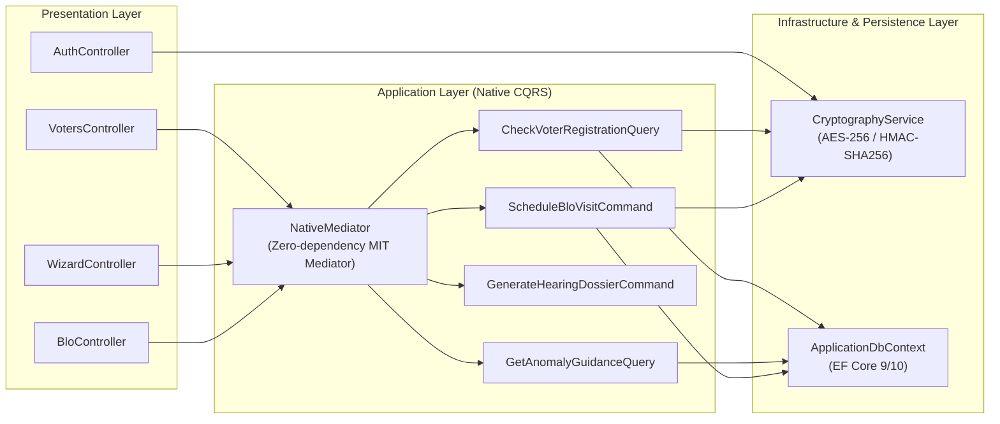
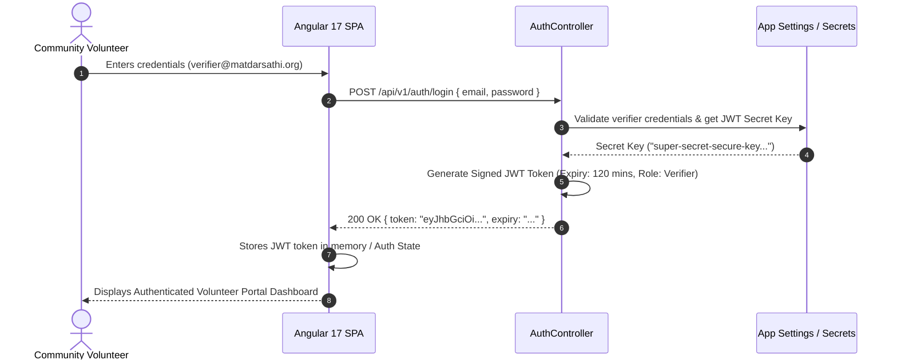
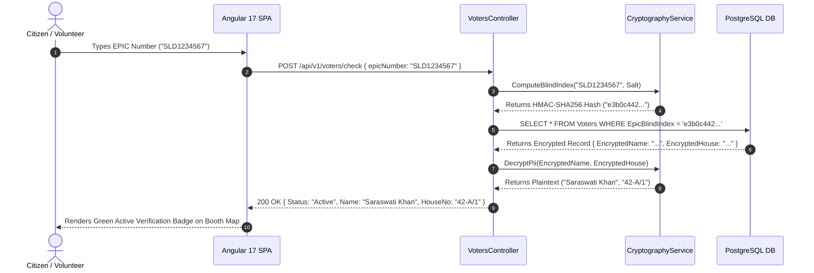
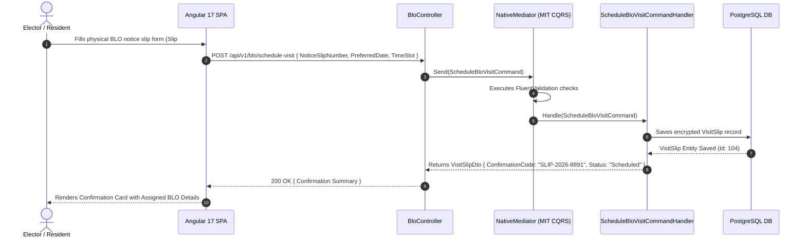
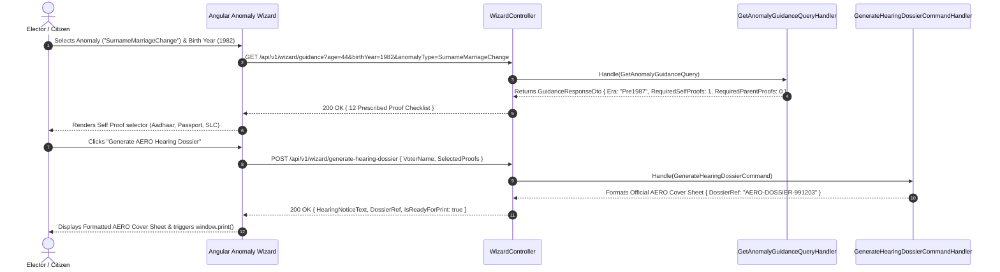

# Enterprise Architecture Specification (ADRs, C4 Model & Sequence Diagrams)

---

## 1. Architecture Decision Records (ADRs)

### ADR-001: Selection of Native C# Mediator over External MediatR Library
*   **Status**: Accepted
*   **Date**: 2026-07-26
*   **Context**: MediatR v13+ moved to a commercial dual-license model. To comply with strict open-source mandates and ensure MatdarSathi can be freely hosted, modified, and redistributed by public civic volunteers without licensing fees, external MediatR dependencies had to be eliminated.
*   **Decision**: Implement a native C# `IMediator` pattern in the Application layer using reflection-based assembly scanning (`services.AddScoped(interface, implementation)`).
*   **Consequences**: 
    *   Zero reliance on commercial NuGet packages (100% MIT-licensed codebase).
    *   Reduced memory footprint and zero external dependency risk.
    *   Maintains strict CQRS Command/Query isolation and SOLID principles.

---

### ADR-002: Selection of PostgreSQL over MongoDB
*   **Status**: Accepted
*   **Date**: 2026-07-26
*   **Context**: Electoral roll data requires strict relational integrity (Constituency -> Polling Station -> Section -> Voter), transactional consistency (ACID) for BLO visit scheduling, and spatial indexing for booth geolocation map lookups.
*   **Decision**: Select PostgreSQL with Entity Framework Core instead of MongoDB or NoSQL document stores.
*   **Consequences**: 
    *   Enforces strict foreign key constraints between voters, polling stations, and visit slips.
    *   Supports PostGIS spatial queries for proximity matching of neutral polling booths.
    *   ACID transactions prevent race conditions when scheduling physical BLO visits.

---

### ADR-003: Zero Raw PII Persistence via AES-256 Encryption & HMAC-SHA256 Blind Indexes
*   **Status**: Accepted
*   **Date**: 2026-07-26
*   **Context**: Storing raw unencrypted voter PII (Names, Addresses, Phone Numbers) exposes the system to legal liabilities and data privacy leaks if a database dump is compromised.
*   **Decision**: All PII fields are encrypted at rest using AES-256. Exact-match queries (EPIC, Phone) use deterministic `HMAC-SHA256` blind indexes with a server secret salt.
*   **Consequences**: 
    *   Stolen database backups reveal no plain-text personal information.
    *   Enables $O(1)$ fast indexed queries for exact matches without decrypting the entire database.

---

### ADR-004: Decoupled Python FastAPI Microservice for PDF Electoral Roll Parsing
*   **Status**: Accepted
*   **Date**: 2026-07-26
*   **Context**: Heavy PDF parsing of 100+ page Indian Electoral Rolls in the main Web API process causes memory spikes and thread pool starvation.
*   **Decision**: Isolate PDF parsing into a lightweight Python 3.11 FastAPI microservice using stream extraction with `pypdf` (BSD) and `PyMuPDF`.
*   **Consequences**: 
    *   Isolates heavy regex and text processing memory overhead to an isolated container.
    *   Page-by-page stream generator keeps RAM consumption strictly under 100MB even for 500-page rolls.

---

## 2. C4 Model Diagrams

### Level 1: System Context Diagram
High-level view showing users and external systems interacting with MatdarSathi.



---

### Level 2: Container Diagram
Applications, microservices, databases, and network boundaries.



---

### Level 3: Component Diagram (.NET Core Backend API)
Internal software components inside the C# Web API.



---

### Level 4: Code Diagram (Class & Entity Relationship Diagram)
Database Entities and Domain Objects.

```mermaid
erDiagram
    POLLING_STATION ||--o{ VOTER_RECORD : "contains"
    POLLING_STATION ||--o{ VISIT_SLIP : "assigned_to"
    VOTER_RECORD ||--o{ VISIT_SLIP : "logs_notice_for"

    POLLING_STATION {
        int Id PK
        string StationName
        string StationLocation
        string AssemblyConstituency
        string PartNumber
        double Latitude
        double Longitude
        string BloName
        string BloContact
        bool IsNeutralGovtFacility
    }

    VOTER_RECORD {
        int Id PK
        string EpicBlindIndex SK
        string EncryptedFullName
        string EncryptedHouseNo
        int Age
        string Gender
        string SectionNumber
        int SerialNumber
        string Status
    }

    VISIT_SLIP {
        int Id PK
        string NoticeSlipNumber UK
        string EncryptedVoterName
        string EncryptedContactNumber
        string PreferredDate
        string PreferredTimeSlot
        string HouseNo
        string PollingStationName
        string Notes
        string Status
        DateTime CreatedAt
    }

    USER_VERIFIER {
        int Id PK
        string Email UK
        string PasswordHash
        string Role
        string AssemblyConstituency
    }
```

---

## 3. Sequence Diagrams (UML Runtime Flows)

### Sequence 1: Volunteer Authentication & JWT Token Flow



---

### Sequence 2: Deterministic Blind Index Voter Lookup Flow



---

### Sequence 3: Physical BLO Notice Visit Slip Scheduling Flow



---

### Sequence 4: SIR Anomaly Guidance & AERO Hearing Dossier Flow


